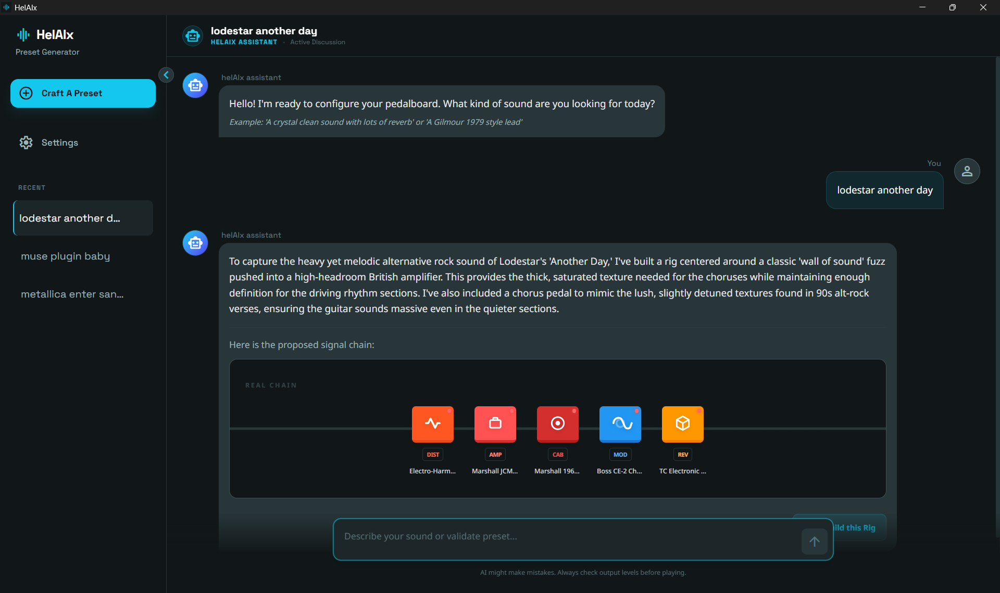
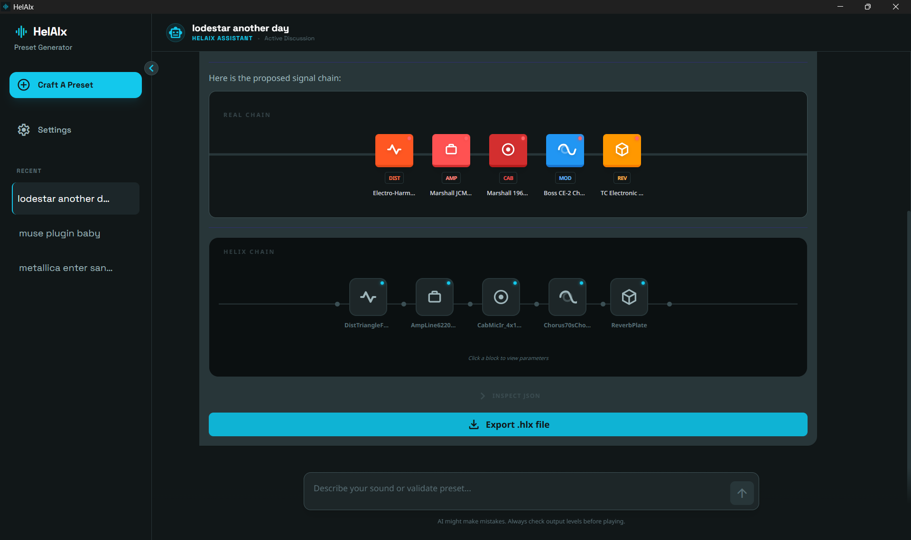

# HelAIx 🎸

**HelAIx** is an AI-powered preset engineer for the Line 6 Helix family. It transforms abstract sound descriptions into fully-functional `.hlx` hardware presets using advanced large language models (LLMs) and a hardware-aware DSP management system.

Talk to the **helAIx assistant** like a pro sound engineer. Describe the tone you want (e.g., *"A 1979 Gilmour lead with lush delays"*), and the assistant will propose a "Real Chain" design and then "Build" the technical mapping for your Helix.


*Defining the tone and building the rig*


*Detailed signal chain visualization*

## ⚙️ Setup

Getting started with HelAIx is easy:

1. **Download or Build**: 
   - Download the latest binary for your OS (Windows or macOS) from the [Releases](https://github.com/MrCitron/helAIx/releases) page.
   - Alternatively, you can build from source (see the [Getting Started](#-getting-started) section below).
2. **Launch**: Run the application on your computer.
3. **Configure LLM**:
   - Open the **Settings** page.
   - Select your LLM provider and model. 
   - *Note: Currently, only **Google Gemini** is supported.*
4. **API Key**: Add your Google Gemini API key. You can get one for free (within limits) at the [Google AI Studio](https://aistudio.google.com/).
5. **Finalize**: Review the other settings like your default export folder and "Helix Model" to match your physical hardware.

## ⚠️ Disclaimers

### Experimental Nature
This application aims to help you get started quickly by creating a base preset that matches your sonic goals. However, AI generation is **far from perfect**. For this version of the application, generated presets will likely require manual refinement (levels, EQ balancing, etc.) in HX Edit or on your device.

### Hardware Safety
This application has currently only been tested on a **Helix Floor** with **Firmware 3.80**. While the application takes precautions to stay within DSP limits, **I am** not responsible for any damage or unexpected behavior the generated presets may cause to your device. Always verify your signal chain and output levels before engaging your speakers or headphones.

## 🛠️ Tech Stack

- **Backend**: Go (Golang)
- **Frontend**: React + Tailwind CSS
- **Framework**: [Wails](https://wails.io/) (Cross-platform Desktop Apps)
- **AI Integration**: Google Gemini API

## 👷‍♂️Getting Started (Build from source)

If you prefer to build the application yourself:

### Prerequisites

- [Go](https://go.dev/dl/) 1.21+
- [Node.js](https://nodejs.org/) & NPM
- [Wails CLI](https://wails.io/docs/gettingstarted/installation)

### Installation

1. Clone the repository:
   ```bash
   git clone https://github.com/MrCitron/helAIx.git
   cd helAIx
   ```

2. Install dependencies:
   ```bash
   npm install --prefix frontend
   ```

3. Run in development mode:
   ```bash
   wails dev
   ```

### Building

To build a standalone production executable for your OS:

```bash
wails build
```

The executable will be generated in the `build/bin` directory.

## 🚀 Future Features

Here are some planned enhancements for future versions of HelAIx:
- **Enhance generated preset quality**: limit the amount of manual refinement required (levels, EQ balancing, etc.).
- **Add more LLM providers**: Currently, only Google Gemini is supported. Other providers like OpenAI, Anthropic, etc. could be added.
- **Custom LLM Prompt Tuning**: Allow users to fine-tune the AI prompts directly in the Settings to better match their personal tone preferences and workflow.
- **Direct Preset Deployment**: Explore ways to push presets directly to the Helix hardware, potentially integrating with HX Edit or using direct USB communication.
- **Variax Input Parameters**: Add support for managing Variax guitar input parameters (tuning, pickup simulation, etc.) for users with compatible instruments like the JTV-89.

Contributions and suggestions are always welcome!

## 🙌 Credits & Kudos

This project stands on the shoulders of the incredible Helix Community. Special thanks to:
- **PerS** for the massive effort in compiling the [Helix Cheat Sheet (v3.80)](https://line6.com/support/topic/67546-a-cheat-sheet-fw-380-amps-cabs-and-effects/?do=findComment&comment=508954), which provided the baseline data for the DSP management system
- **[sensorium/phelix](https://github.com/sensorium/phelix)** that helped me to create the catalog.json and template.json files
- All the community members who share their knowledge and data to make tools like this possible.

## 📄 License

This project is licensed under the **MIT License** - see the [LICENSE](LICENSE) file for details. Anyone is free to reuse, modify, and distribute this code, provided that credit is given to the original origin.

---
*Created with ❤️ by @MrCitron for the Helix community.*
